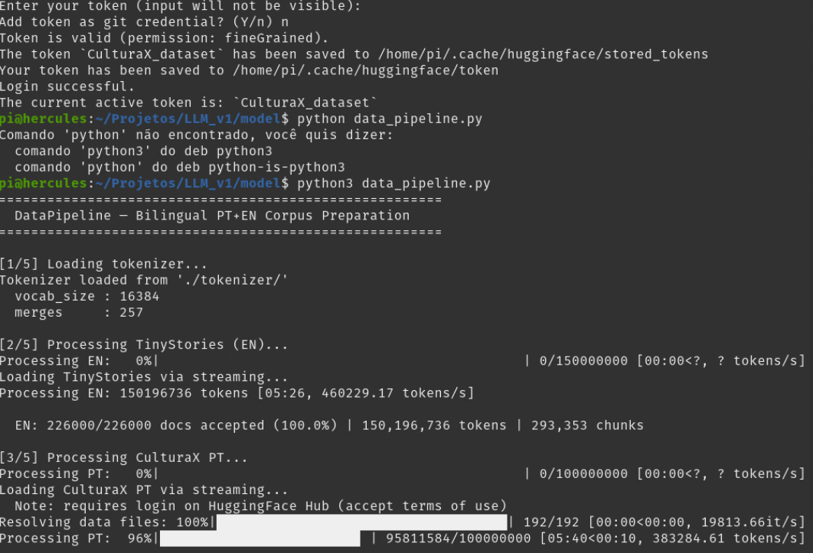
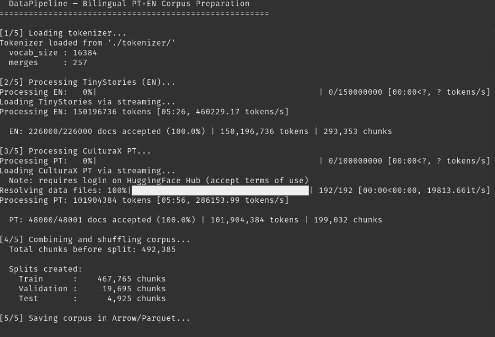
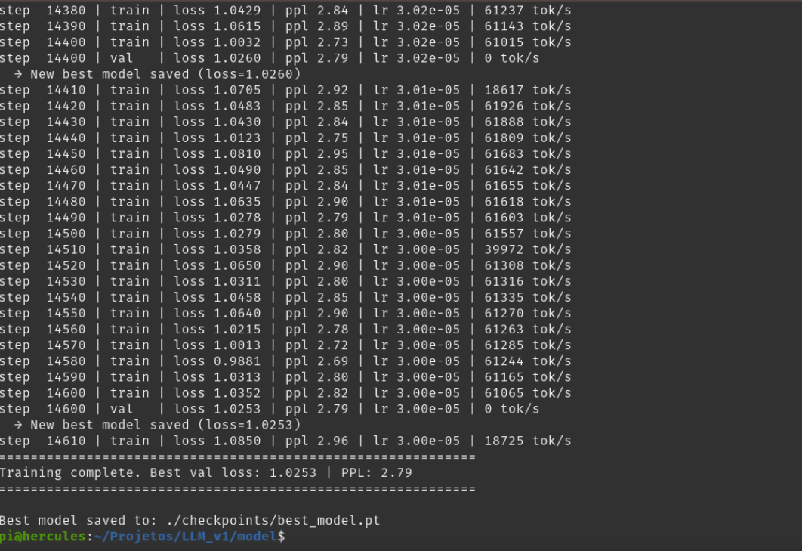
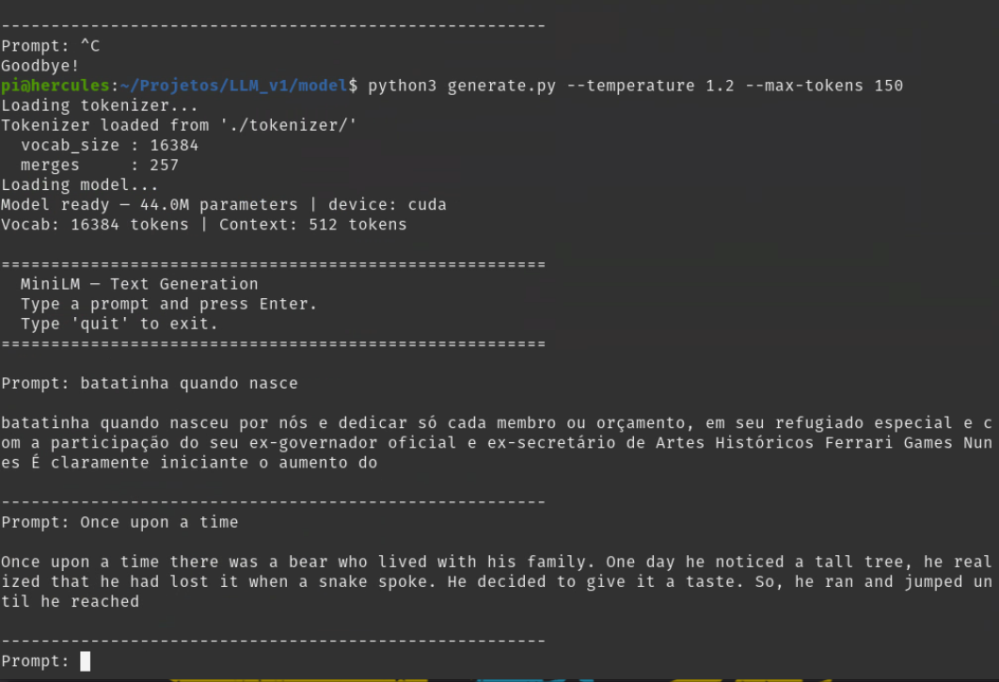
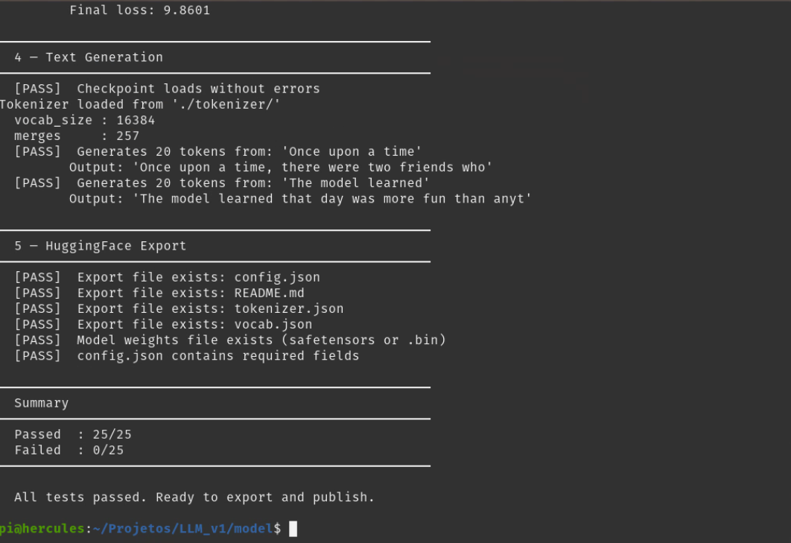

# MiniLM — A Bilingual PT+EN Language Model Built from Scratch

> A bilingual PT+EN LLM with BPE tokenizer and training loop implemented from scratch, with didactic and documented code.
> What we seek here is a hands-on experience to better understand how LLM models work at a low level.
> Do not expect a heavy, robust model ready to compete with large models like Claude or Gemini.
> In fact, do not even expect conversations in a prompt.
> What we really have here is a small didactic model that will barely be able to complete words in Portuguese (Brazil) and English (USA), but where the main focus is on didactics, on learning how a model of this type really works...
> It is about deeply understanding how the roots that sustain the super models are built.
> This is the "Mister M" project, showing how the magic works under the hood...

> To train this model, 2 public datasets were used:
> 	TinyStories (Eldan & Li, 2023)
> 	CulturaX PT (Nguyen et al., 2023)

> Transformer architecture, BPE tokenizer and training loop
> built from scratch in pure Python and PyTorch, without the use of high-level frameworks.
> The training hardware was a locally assembled PC with a dual-core i9 motherboard, 128GB of RAM and two RTX 4060 Ti GPUs with 16GB VRAM each.
> Linux Pop!_OS 22.04 LTS 
> 14/03/2026


---

## Motivation

Most publicly available LLM projects are fine-tunings of existing models — they reuse tokenizers, architectures and ready-made training loops.

This project takes the opposite approach: every component is implemented from scratch, with detailed academic documentation explaining **what**, **why** and **how** each decision was made. The goal is to be a didactic reference for those who want to understand LLMs in depth, not just use them.


---

## Development

This project was developed in *pair programming* with **Claude from Anthropic** (a very "nice people" LLM model), in my view the best model available for tasks where logic is indispensable, such as electrical/electronic engineering and programming; an LLM used as a code assistant, documentation reviewer and architectural decision support throughout the entire process.

The use of AI as a development tool is an intentional part of the methodology; just as a developer consults documentation, papers and colleagues, this project explored the use of LLMs as an active partner in the creative and technical process. In doing so, it pursues a more modern development approach based on agile methodologies, aiming at what I consider to be the future of engineering and systems development — where the goal is to maximize productivity, even intellectual productivity.

Development was carried out using **Eclipse IDE** with the **PyDev** plugin, providing a robust environment for editing, debugging and running Python modules. This further supports the high-productivity objective, as Eclipse flags primary errors before time is lost debugging.

All code was reviewed, understood, validated and edited by the author before being incorporated into the project.

The model developed here was trained and stress-tested, with each component validated before publication.


---

## 2026: A New Approach...

Working with complex models like Claude or Gemini triggers a structural and paradigm shift unlike anything seen before.

It is like having a coworker with the knowledge of the entire Internet and the experience of a junior developer.

It changes the professional's posture. Because now you need to think much faster without losing attention to detail.

And while you now have an active window into the entire knowledge of the Internet, you also need to learn much more and much faster in order to evaluate what is being created, steer the LLM, and still be able to solve even more complex problems when the model enters a continuous and cyclical hallucinatory loop — nothing that anyone used to mentoring interns and junior developers hasn't already dealt with before ;)

Working directly with complex models does not only accelerate productivity — it forces you to accelerate learning.

Yes, even the most powerful AI models can create bugs...


---

## Features

| Component           | Implementation                             |
|---------------------|--------------------------------------------|
| Tokenizer           | BPE (Byte Pair Encoding) from scratch      |
| Architecture        | Transformer Decoder-only (GPT/LLaMA-style) |
| Normalization       | RMSNorm                                    |
| Positional Encoding | RoPE (Rotary Position Embedding)           |
| FFN Activation      | SwiGLU                                     |
| Training Loop       | Custom — no HuggingFace `Trainer`          |
| Mixed Precision     | Native bfloat16                            |
| Languages           | Brazilian Portuguese + English (bilingual) |


---

## Project Structure

```
── model
│   ├── bpe_tokenizer.py    # BPE Tokenizer implemented from scratch
│   ├── data_pipeline.py    # Bilingual corpus preparation pipeline
│   ├── transformer.py      # Full Transformer architecture
│   ├── test_model.py       # Pre-publication test suite
│   ├── generate.py         # Interactive text generation (try the model live!)
│   └── training_loop.py    # Custom training loop + HF export
├── README.md               # This file
└── requirements.txt        # Dependencies
```


---

## Requirements

- Python 3.10+
- PyTorch 2.1+ with CUDA 12.x
- GPU with 8GB+ VRAM (tested on RTX 4060 Ti 16GB)

```bash
# Install PyTorch with CUDA 12.1
pip3 install torch --index-url https://download.pytorch.org/whl/cu121

# Install remaining dependencies
pip3 install -r requirements.txt
```


---

## Quick Start

The complete pipeline runs in 4 steps, always in this order:

```bash
# Step 1 — Train the BPE tokenizer (must run first)
python3 bpe_tokenizer.py

# Step 2 — Download datasets and prepare the corpus
python3 data_pipeline.py --dry-run          # quick validation (~5min)
python3 data_pipeline.py                    # full corpus (~1GB, may take hours)

# Step 3 — Train the model
python3 training_loop.py --small            # quick validation (~5min)
python3 training_loop.py                    # full training

# Step 4 — Export to HuggingFace (after training is complete)
python3 training_loop.py --mode export \
    --checkpoint ./checkpoints/best_model.pt \
    --output-dir ./hf_export \
    --tokenizer-path ./tokenizer
```

> **Note — CulturaX requires manual access approval before Step 2:**
>
> **1.** Create a free account at https://huggingface.co (if you don't have one)
>
> **2.** Visit the dataset page and accept the terms of use:
> https://huggingface.co/datasets/uonlp/CulturaX
>
> **3.** Generate an access token at:
> https://huggingface.co/settings/tokens
>
> **4.** Log in on the machine where the pipeline will run:
> ```bash
> huggingface-cli login
> # paste your token when prompted
> ```
>
> TinyStories (English) does not require login and will be processed normally.
> The pipeline will fail with `DatasetNotFoundError` if Steps 1–4 are skipped.


*Login successful and TinyStories (EN) being processed via streaming.*


---

### What each step does

**Step 1 — `bpe_tokenizer.py`**

Trains the BPE tokenizer on a built-in demo corpus and saves it to `./tokenizer/`.
This file must exist before Step 2 can run, since the pipeline uses it to tokenize the downloaded text.

**Step 2 — `data_pipeline.py`**

Downloads the training datasets via streaming (no manual download needed) and processes them:
- **TinyStories** (`roneneldan/TinyStories`) — short English stories (~60%)
- **CulturaX PT** (`uonlp/CulturaX`) — curated Portuguese web text (~40%)

Cleans, tokenizes and saves the corpus to `./corpus/` in Arrow/Parquet format.
Use `--dry-run` first to validate the environment before running the full pipeline.


*Full pipeline run: 150M EN tokens + 101M PT tokens processed, 492,385 chunks created and split.*

**Step 3 — `training_loop.py`**

Trains the model on the prepared corpus. Progress is logged to `./checkpoints/training.log`:

```
step    100 | train | loss 6.2341 | ppl 508.12 | lr 3.00e-04 | 12450 tok/s
step    200 | val   | loss 5.8901 | ppl 361.54 | lr 2.97e-04 |     0 tok/s
step    300 | train | loss 5.4123 | ppl 224.31 | lr 2.91e-04 | 12380 tok/s
...
```

Use `--small` first to confirm everything works before committing to a full training run.
The best checkpoint is saved automatically to `./checkpoints/best_model.pt`.


*Training log showing loss converging to ~1.02 (PPL 2.79) over 14,600 steps at ~61,000 tok/s.*

**Step 4 — Export and publish**

Packages the trained model into HuggingFace format (`./hf_export/`) ready for upload.


---

### Using the trained model

After training, load and run the model directly in Python:

```python
import torch
from transformer import MiniLM, ModelConfig
from bpe_tokenizer import BPETokenizer

# Load tokenizer and model
tokenizer = BPETokenizer.load("./tokenizer")
model = MiniLM(ModelConfig())
ckpt = torch.load("./checkpoints/best_model.pt", map_location="cpu")
model.load_state_dict(ckpt["model_state"])
model.eval()

# Generate text
prompt = "Once upon a time"
input_ids = torch.tensor([tokenizer.encode(prompt)])
output = model.generate(
    input_ids,
    max_new_tokens=200,
    temperature=0.8,
    top_k=50,
    top_p=0.9,
)
print(tokenizer.decode(output[0].tolist()))
```


---

## Try It Live

After training, run the interactive generation script and type any prompt:

```bash
python3 generate.py
```

```
Prompt: Once upon a time
Once upon a time there was a little girl who loved to play in the garden...

Prompt: The model learned
The model learned that day was more fun than anything he had ever done before...

Prompt: Batatinha quando nasce
Batatinha quando nasce debaixo da terra fica escondida...
```

Adjust generation behavior with optional flags:

```bash
# More creative output
python3 generate.py --temperature 1.2 --max-tokens 150

# More conservative output
python3 generate.py --temperature 0.5 --top-k 20

# Custom checkpoint or tokenizer path
python3 generate.py --checkpoint ./checkpoints/best_model.pt --tokenizer ./tokenizer
```

| Flag | Default | Effect |
|---|---|---|
| `--max-tokens` | 80 | Number of new tokens to generate |
| `--temperature` | 0.8 | Higher = more creative, lower = more predictable |
| `--top-k` | 50 | Limits sampling to the top-k most probable tokens |
| `--top-p` | 0.9 | Nucleus sampling threshold |


*The model in action: Portuguese output reflects the web-style CulturaX corpus, while English output shows the clean narrative style learned from TinyStories — corpus quality directly shapes generation quality.*


---

## Testing Before Use

Before exporting and uploading to HuggingFace, run the test suite
to validate all components end-to-end:

```bash
# Run all tests
python3 test_model.py

# Run a specific group only
python3 test_model.py --only tokenizer
python3 test_model.py --only corpus
python3 test_model.py --only model
python3 test_model.py --only generate
python3 test_model.py --only export
```

The test suite covers 5 groups:

| Group | What it validates |
|---|---|
| `tokenizer` | Files exist, load, encode/decode round-trip, vocab size |
| `corpus`    | Splits exist, chunk shape, token IDs within vocab range |
| `model`     | Forward pass, initial loss, loss decreases with training |
| `generate`  | Loads checkpoint, generates correct number of tokens |
| `export`    | All HuggingFace files present and config.json valid |

All tests must pass before publishing.


*All 25 tests passing — model ready to export and publish.*


---

## Architecture in Detail

```
Tokens (B, T)
    │
    ▼
Token Embedding  ──────────────────── (vocab_size → d_model)
    │
    ▼
┌─────────────────────────────────┐
│  TransformerBlock × N           │
│                                 │
│  ┌─ RMSNorm                     │
│  │      ↓                       │
│  │  CausalSelfAttention         │
│  │    ├─ QKV Projection         │
│  │    ├─ RoPE on Q and K        │
│  │    ├─ Masked Attention       │  ← causal attention
│  │    └─ Output Projection      │
│  │      ↓                       │
│  └─ residual (+)                │
│                                 │
│  ┌─ RMSNorm                     │
│  │      ↓                       │
│  │  SwiGLU FFN                  │
│  │    ├─ Gate Projection        │
│  │    ├─ Up Projection          │
│  │    └─ Down Projection        │
│  │      ↓                       │
│  └─ residual (+)                │
└─────────────────────────────────┘
    │
    ▼
Final RMSNorm
    │
    ▼
LM Head  ──────────────────────────── (d_model → vocab_size)
    │
    ▼
Logits (B, T, vocab_size)
```

### Available Configurations

| Model   | Parameters | d_model | Layers | Heads | d_ff  |
|---------|-----------|---------|--------|-------|-------|
| Tiny    | ~15M      | 256     | 4      | 4     | 768   |
| Small   | ~85M      | 512     | 8      | 8     | 1536  |
| Base    | ~310M     | 768     | 12     | 12    | 2304  |


---

## Credits

| Contributor        | Role                                                     |
|--------------------|----------------------------------------------------------|
| André Costa        | Author, project architect, validation and publication    |
| Claude (Anthropic) | Co-development, academic documentation, technical review |


---

## References

```
Vaswani, A. et al. (2017).
    Attention is all you need. NeurIPS.

Gage, P. (1994).
    A new algorithm for data compression. C Users Journal, 12(2).

Sennrich, R., Haddow, B., & Birch, A. (2016).
    Neural machine translation of rare words with subword units. ACL.

Zhang, B., & Sennrich, R. (2019).
    Root mean square layer normalization. NeurIPS.

Su, J. et al. (2021).
    RoFormer: Enhanced transformer with rotary position embedding.
    arXiv:2104.09864.

Shazeer, N. (2020).
    GLU variants improve transformer. arXiv:2002.05202.

Touvron, H. et al. (2023).
    LLaMA: Open and efficient foundation language models.
    arXiv:2302.13971.

Loshchilov, I., & Hutter, F. (2019).
    Decoupled weight decay regularization. ICLR.

Eldan, R., & Li, Y. (2023).
    TinyStories: How small can language models be while still speaking
    coherent English? arXiv:2305.07759.

Nguyen, T. et al. (2023).
    CulturaX: A cleaned, enormous, and multilingual dataset for large
    language models. arXiv:2309.09400.
```


---

## License

MIT License — free to use, modify and distribute with attribution.
See [LICENSE](LICENSE) for details.


---

## Citation

```bibtex
@misc{minilm2026,
  title   = {MiniLM: A bilingual PT+EN language model built from scratch},
  author  = {André Costa},
  year    = {2026},
  url     = {https://huggingface.co/AndreCosta/minilm},
  license = {MIT}
}
```
